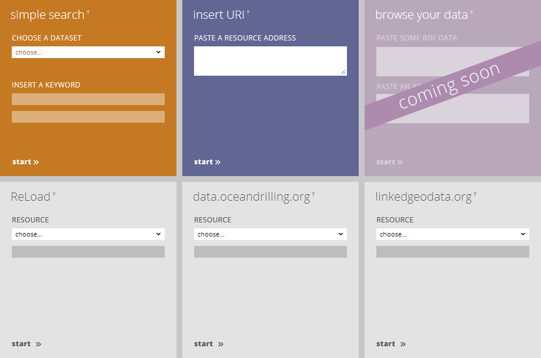
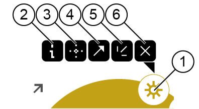

Browsing Resources
==================

Using the Endpoint Access Panel
-------------------------------



* Choose an Endpoint.
* Add keywords.
* Click **Start**.

&rarr; The Endpoint is shown as a resource on the LodLive canvas.

Entering Your Own URI 
---------------------

In your browser's address bar,

* Append your URI after the question mark `?`.
* Click **Go**.

Example:

```html
http://en.lodlive.it/?http://www.domain.com/path/to/resource.rdf
```

&rarr; The Endpoint is shown as a resource on the LodLive canvas.


Browsing
--------

* Clicking an Object Property to open other resources.
* Drag and Drop resources to arrange them on the canvas.
* Close resources you are not interested in.

**Please Note:**
Every time an owl:sameAs property is reached during browsing, LodLive will draw a connection to the related resource. This way, you can browse direct and inverse relations.

### Toolbox



1. Toolbox Button
2. Access Query Panel
3. Focus this resource (will close all other resources)
4. Open this resource in its original location
5. Expand all Object Properties for this resource
6. Remove resource from canvas
